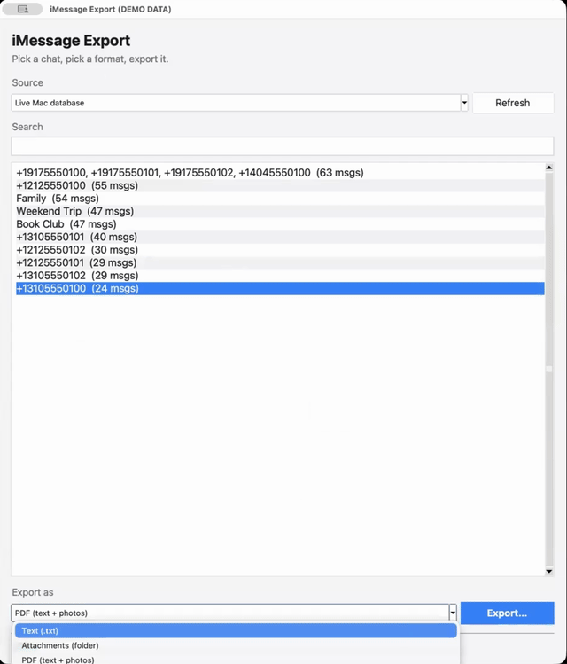
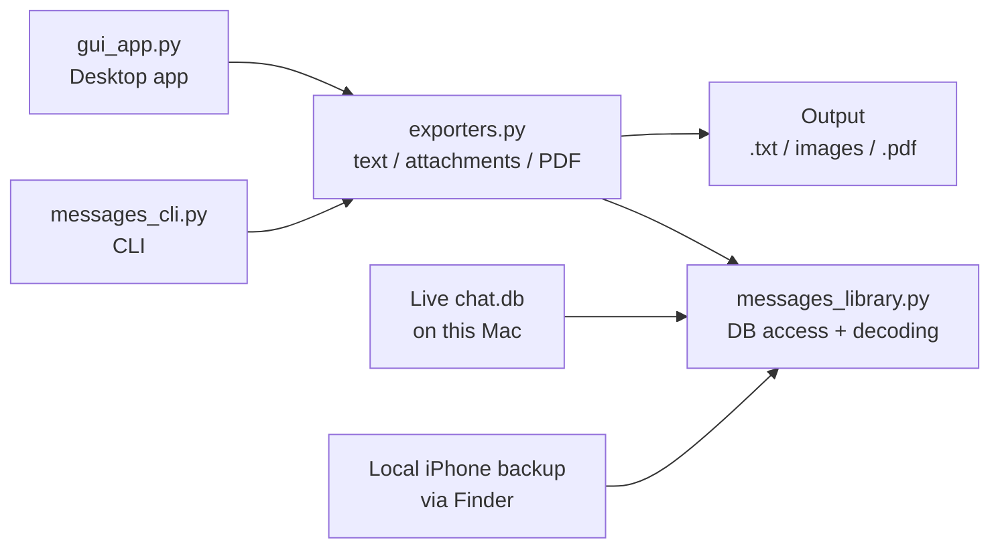

# imessage-export

Command-line tool for exporting iMessage conversations — text, attachments,
and a combined PDF — from the live macOS Messages database or an
unencrypted local iPhone backup.

(All data is fake).


## How it works



## Requirements

- macOS, Python 3.9+ (the GUI and test suite need a modern Tk — macOS's
  system Python doesn't have one; see [Desktop app](#desktop-app-no-terminal-required))
- **Full Disk Access** for your terminal/app, under **System Settings →
  Privacy & Security**, then restart the terminal — macOS blocks
  `chat.db` reads without it, even for your own account.

## Install

```bash
python3 -m pip install --user -e .
```

This installs the `imessage-export` command (via `pyproject.toml`'s
`[project.scripts]` entry point). If the command isn't found afterward, make
sure `~/Library/Python/<version>/bin` is on your `PATH`.

Without installing, every command also works as `python3 messages_cli.py ...`
from the repo root. `requirements.txt` (runtime deps only) and
`requirements-dev.txt` (adds `pytest`) are there too, if you'd rather
`pip install -r requirements.txt` than use the editable install above — both
describe the same dependencies as `pyproject.toml`.

## Usage

Every command that targets a specific chat accepts either `--chat-id N`
(from `list-chats`) or `--identifier <phone-or-email>`, and either reads the
live Mac database (default) or a local iPhone backup via `--backup`.

```bash
# List every chat with its ROWID, message count, and label.
imessage-export list-chats

# Export one chat's text messages to a file (or stdout).
imessage-export export --chat-id 42 -o conversation.txt

# Copy every attachment (photos, videos, etc.) out of a chat.
imessage-export export-attachments --identifier +15551234567 -o ./attachments

# Render a chat (text + inline photos) to a single PDF.
imessage-export export-pdf --chat-id 42 -o conversation.pdf

# Check how far back a chat's local history actually goes.
imessage-export info --chat-id 42

# List local iPhone backups Finder has made on this Mac.
imessage-export list-backups

# Read from an iPhone backup instead of the live Mac DB.
imessage-export list-chats --backup <udid-or-prefix>
```

Run `imessage-export <command> --help` for the full flag list.

## Desktop app (no terminal required)

For people who don't want to use the command line, there's a Tkinter GUI
(`gui_app.py`) that can be packaged into a double-clickable `.app` (see the
demo above).

**Important:** build it with a Python that has a modern Tk, not macOS's
system Python. macOS's built-in Python links against Apple's bundled Tcl/Tk
**8.5**, which is long-deprecated and known to be broken on current macOS
(the app launches as a process but no window ever appears — no crash, no
error, just nothing). Use Homebrew's Python + `python-tk` instead, which
pulls in a real, current Tcl/Tk:

```bash
brew install python-tk@3.12   # only needed once
/opt/homebrew/bin/python3.12 -m venv .venv
.venv/bin/python -m pip install pillow fpdf2 py2app "setuptools<81"
.venv/bin/python setup_app.py py2app
open "dist/iMessage Export.app"
```

(`setuptools<81` avoids a separate, unrelated incompatibility: newer
setuptools populates `install_requires` from `pyproject.toml`, which trips
py2app's own guard against it. `setup_app.py` also hides `pyproject.toml`
from setuptools for the duration of the build, for the same reason.)

You can sanity-check which Tk a given `python3` has before building:

```bash
python3 -c "import tkinter; print(tkinter.TkVersion)"
```

If that prints `8.5`, that interpreter can't build a working GUI — use the
`.venv` above instead.

Once built: pick a chat from the list (or an iPhone backup from the
"Source" dropdown), choose Text / Attachments / PDF, click Export, and pick
where to save. Full Disk Access still applies — the app will explain what to
do if it can't read the database yet.

`dist/`, `build/`, and `.venv/` aren't checked in; anyone who wants the
`.app` builds it locally with the commands above.

### Reading from an iPhone backup

The "Messages in iCloud" syncing is lazy, and history can be capped by the "Keep Messages"
retention setting. Therefore Mac's local `chat.db` isn't always the full history.
If an iPhone has a longer local history, you can read straight 
from a **local, unencrypted** Finder backup instead:

1. Connect the iPhone, open Finder, select it in the sidebar.
2. Under **General**, choose "Back up all data on your iPhone to this Mac",
   make sure **"Encrypt local backup" is unchecked**, then **Back Up Now**.
3. `imessage-export list-backups` to find its UDID.
4. Pass `--backup <udid-or-prefix>` to any command.

## Testing

Most of the suite runs fine under plain `python3 -m pip install --user -e ".[dev]"`
+ `python3 -m pytest`. **`tests/test_gui_app.py` is the exception** — it
drives a real Tkinter event loop, which hangs indefinitely under macOS's
system Tk 8.5 (the same brokenness described in
[Desktop app](#desktop-app-no-terminal-required)). Run the full suite,
GUI test included, with the same venv used to build the app:

```bash
brew install python-tk@3.12   # only needed once
/opt/homebrew/bin/python3.12 -m venv .venv
.venv/bin/python -m pip install pillow fpdf2 pytest
.venv/bin/python -m pytest
```

Tests use synthetic fixtures (an in-memory SQLite database shaped like
`chat.db`, fabricated backup directories, a real temp-file SQLite DB for the
GUI's threading test, generated images) — no real Messages data is read or
required to run the suite.

## Future Enhancements

- **`attributedBody` decoding is heuristic**, not a full typedstream parser:
  it looks for the first `NSString` value in the blob, which is the plain
  text for ordinary messages but can misfire on messages with unusual rich
  formatting.
- **PDF emoji**: text renders with a bundled macOS Unicode font
  (`Arial Unicode.ttf`) that doesn't include color emoji glyphs, so emoji
  show as blank space rather than crashing or garbling the page.
- **HEIC photos** are converted to JPEG via macOS's `sips` for PDF
  embedding; if `sips` is unavailable the original file is embedded as-is
  (and will likely fail to render as an image).
- **Video/audio attachments** aren't embedded in the PDF, just noted with a
  placeholder line.

## Acknowledgements

This is a small, focused Python tool that was inspired by
[imessage-exporter](https://github.com/ReagentX/imessage-exporter), and by
[imessage-relationship-analytics](https://github.com/rnorlund/imessage-relationship-analytics/blob/main/messages_lib.py).Q